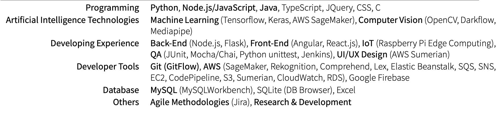

### Hi there 👋

<!--
**Akathian/Akathian** is a ✨ _special_ ✨ repository because its `README.md` (this file) appears on your GitHub profile.

Here are some ideas to get you started:

- 🔭 I’m currently working on ...
- 🌱 I’m currently learning ...
- 👯 I’m looking to collaborate on ...
- 🤔 I’m looking for help with ...
- 💬 Ask me about ...
- 📫 How to reach me: ...
- 😄 Pronouns: ...
- ⚡ Fun fact: ...
-->

I am an ambitious and self-directed 4th-year student <b>double majoring in Computer Science and Neuroscience</b>. I strive in highly collaborative work environments and enjoy solving challenging problems. I am comfortable using Linux/Ubuntu and MacOS as a daily driver. I also possess excellent work ethics, allowing for efficient work flow and exceptional attention to detail. I hope to one day make breakthroughs in the artificial intelligence field, applying advanced knowledge in neuroscience and computer science topics.

### Key Competencies

 
  Visitor count 
  

